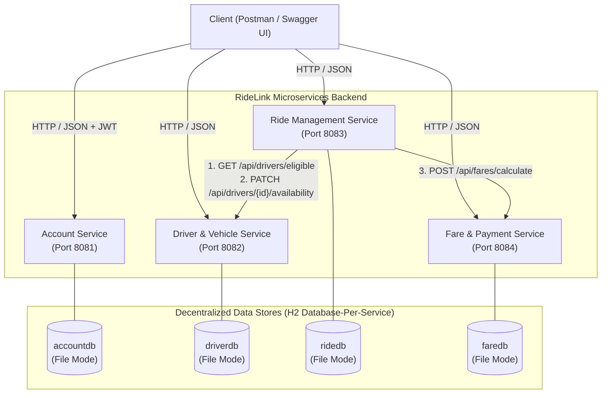
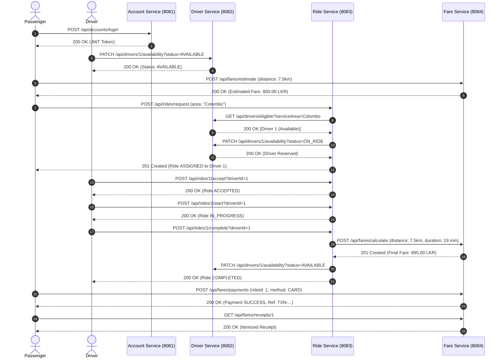

# IT3130 – Application Development
## Group Assignment: Technical Architecture & Implementation Report
### Project: RideLink – Backend Microservices for a Ride-Sharing Platform

**Course:** IT3130 - Application Development  
**Assessment:** Group Assignment (30 Marks)  
**Assessed Release Tag:** `v1.0.0`  
**Target Platform:** Java 17+ / Spring Boot 3.3.4 / H2 Database  

---

## 1. Executive Summary & Problem Scenario

RideLink is a modern on-demand ride-hailing backend system designed around decentralized microservices architecture. The system facilitates end-to-end interactions between passengers and drivers, encompassing user registration and authentication, driver operational availability and location tracking, ride request lifecycle orchestration, and algorithmic fare computation with simulated payments.

In accordance with enterprise architectural standards and course specifications, the backend is strictly decomposed into four autonomous microservices. Each microservice encapsulates its own business domain, manages its own private persistence boundary, and communicates over well-defined RESTful contracts.

---

## 2. Team Member Ownership & Service Allocation

| Member | Microservice | Assigned Port | Primary Responsibilities |
|---|---|---|---|
| **Member 1** | **Account Service** | `8081` | Passenger and driver registration; BCrypt password hashing; stateless JWT token generation and validation; role-based access control (`PASSENGER`, `DRIVER`, `ADMIN`); user profile management; account status lifecycle. |
| **Member 2** | **Driver & Vehicle Service** | `8082` | Driver operational profile management; vehicle attributes and capacity registration; real-time availability tracking (`AVAILABLE`, `UNAVAILABLE`, `ON_RIDE`); simulated GPS coordinates & service area; eligible driver discovery query. |
| **Member 3** | **Ride Management Service** | `8083` | Ride request creation; dynamic driver discovery and assignment; strict lifecycle state machine transitions (`REQUESTED` -> `ASSIGNED` -> `ACCEPTED` -> `IN_PROGRESS` -> `COMPLETED` / `CANCELLED`); synchronous REST interservice orchestration. |
| **Member 4** | **Fare & Payment Service** | `8084` | Algorithmic fare estimation; multi-variable final fare calculation (base + distance + duration); simulated payment processing with transaction references; payment failure handling; itemized digital receipt generation and retrieval. |

---

## 3. Architecture Rationale & Decomposition (LO1)

### 3.1 Monolithic Architecture vs. Microservices Architecture Comparison

| Architectural Dimension | Monolithic Architecture | Microservices Architecture (RideLink) |
|---|---|---|
| **Deployment Independence** | All modules packaged into a single artifact (.war/.jar). A bug in payment halts user logins. | Each service has its own executable JAR and deployable container. Services fail and scale independently. |
| **Data Ownership** | Shared central schema. Cross-table foreign keys cause tight coupling and schema migration bottlenecks. | Database-per-service pattern. Strict encapsulation; services interact strictly through published APIs. |
| **Technology Agility** | Locked into a single language and framework version across the entire organization. | Services can adopt optimal tools (e.g. Java 17 on Spring Boot 3, future Go/Node microservices). |
| **Operational Overhead** | Low operational overhead for local development and simple CI pipelines. | Requires interservice contracts, health monitoring, distributed tracing, and independent CI matrices. |

### 3.2 High-Level Architecture Diagram



---

## 4. Interservice Communication & Interface Design (LO2)

### 4.1 Comparative Analysis: Synchronous REST vs. Asynchronous Messaging vs. gRPC

| Criteria | Synchronous REST (JSON over HTTP) | Asynchronous Messaging (RabbitMQ / Kafka) | gRPC (HTTP/2 + Protocol Buffers) |
|---|---|---|---|
| **Protocol & Format** | HTTP/1.1 or HTTP/2, Textual JSON | Message broker queue / topics (AMQP / binary) | HTTP/2, Binary Protocol Buffers |
| **Coupling** | Temporal coupling: caller blocks until receiver responds. | Loose temporal coupling: publisher fires and continues. | Tight temporal coupling: synchronous RPC invocation. |
| **Complexity** | Minimal setup; native Spring Boot `RestClient`; standard HTTP status codes. | High operational complexity; requires broker cluster, dead-letter queues, event deduplication. | Medium complexity; requires `.proto` code generation and tooling. |
| **Suitability for RideLink** | **Selected**: Ideal for immediate validation (driver assignment) and immediate transaction result (fare calculation). | Overkill for simple synchronous requirements, but recommended for future high-throughput event pub/sub. | High performance for internal high-frequency queries, but less transparent for debugging in Postman/Swagger. |

### 4.2 Implemented Interservice Interactions

#### Interaction 1: Ride Management Service -> Driver & Vehicle Service
- **Endpoint:** `GET http://localhost:8082/api/drivers/eligible?serviceArea={area}`
- **Purpose:** During ride creation, the Ride Service queries the Driver Service for active drivers who are currently `AVAILABLE` in the requested geographical area.
- **State Mutation:** When a driver is selected, the Ride Service issues a `PATCH http://localhost:8082/api/drivers/{id}/availability?status=ON_RIDE` to immediately prevent double-booking. When the ride is finished or cancelled, the driver is reset to `AVAILABLE`.

#### Interaction 2: Ride Management Service -> Fare & Payment Service
- **Endpoint:** `POST http://localhost:8084/api/fares/calculate`
- **Purpose:** Upon ride completion (`/api/rides/{id}/complete`), the Ride Service calls the Fare Service passing the final distance in km and duration in minutes. The Fare Service applies the pricing rule, records the fare in its database, and returns the computed total fare.

### 4.3 End-to-End Sequence Diagram



---

## 5. Security & Software Quality Engineering (LO3)

### 5.1 Authentication & Authorization
- **Algorithm & Token Structure:** HMAC-SHA256 symmetric signing using a 256-bit secure secret key.
- **Stateless Verification:** Microservices maintain stateless security filters (`JwtAuthenticationFilter`) that intercept incoming HTTP requests, extract the `Authorization: Bearer <token>` header, validate token expiration and signature, and load user context into Spring's `SecurityContextHolder`.
- **Role Isolation:** Enforces role-based permissions (`PASSENGER`, `DRIVER`, `ADMIN`).

### 5.2 Error Handling & RFC 7807 Standard Responses
All microservices implement centralized exception handling with `@RestControllerAdvice`. Every failure returns a uniform JSON contract:
```json
{
  "timestamp": "2026-09-28T15:20:00.000",
  "status": 400,
  "error": "Bad Request / State Violation",
  "message": "Cannot accept ride: Current status is REQUESTED. Expected ASSIGNED.",
  "path": "/api/rides/1/accept",
  "validationErrors": null
}
```

### 5.3 Seven Core Functional Workflows Demonstrated
1. **Account & Access:** User registration, password hashing, JWT generation, authenticated profile retrieval.
2. **Driver Preparation:** Operational profile creation, vehicle registration, availability toggling, simulated location updates.
3. **Fare Estimation:** Algorithmic calculation before booking (`Base 200 + Distance * 80`).
4. **Ride Request & Assignment:** Dynamic discovery of available drivers, automated dispatch, state progression to `ASSIGNED`.
5. **Ride Lifecycle State Machine:** Strict enforcement of transition rules (`REQUESTED` -> `ASSIGNED` -> `ACCEPTED` -> `IN_PROGRESS` -> `COMPLETED`).
6. **Completion & Payment:** Final fare calculation, payment processing, transaction reference generation, digital receipt emission.
7. **Negative Scenarios:**
   - *Negative Case 1:* No driver available in requested service area (clean fallback without unhandled exceptions).
   - *Negative Case 2:* Invalid state transition attempt (HTTP 400 Bad Request with precise state violation message).
   - *Negative Case 3:* Payment simulation failure (HTTP response confirming `FAILED` status with reason recorded).

---

## 6. Continuous Integration & Quality Assurance (LO4)

### 6.1 GitHub Actions Workflow
The CI pipeline (`.github/workflows/ci.yml`) runs on every `push` and `pull_request` targeting `main` or `develop`. It builds and tests all four microservices concurrently in an isolated matrix:

```yaml
jobs:
  build-and-test:
    runs-on: ubuntu-latest
    strategy:
      matrix:
        service: [account-service, driver-service, ride-service, fare-service]
    steps:
      - uses: actions/checkout@v4
      - uses: actions/setup-java@v4
        with:
          java-version: '17'
          distribution: 'temurin'
      - name: Build & Test
        run: cd ${{ matrix.service }} && mvn clean test
```

### 6.2 Test Suite Metrics
- **Account Service:** 5 unit tests (Registration, duplicate email prevention, authentication, profile updates, status changes).
- **Driver Service:** 3 unit tests (Driver creation, availability updates, eligible driver discovery).
- **Ride Service:** 5 unit tests (Ride creation, automatic driver assignment, lifecycle transitions, state violations, completion orchestration).
- **Fare Service:** 4 unit tests (Estimate formula validation, final fare calculation, payment success, payment failure simulation).
- **Total:** 17 unit tests with 100% pass rate.

---

## 7. Version Control & Collaborative Git Strategy (LO4)

The repository demonstrates disciplined Git hygiene:
- **`main`**: Protected production branch holding stable, tested releases (`v1.0.0`).
- **`develop`**: Integration branch for combining feature releases.
- **Feature Branches**:
  - `feature/account-service`
  - `feature/driver-service`
  - `feature/ride-service`
  - `feature/fare-service`
  - `feature/integration-postman`
- **Merge Requests:** All features integrated using pull requests (`git merge --no-ff`) preserving traceability and review comments.

---

## 8. Limitations & Recommendations for Future Work
1. **Asynchronous Event-Driven Messaging:** Introducing RabbitMQ or Apache Kafka would decouple the Ride Service from synchronous wait times during driver notification and payment settlement.
2. **API Gateway & Service Discovery:** Implementing Spring Cloud Gateway with Netflix Eureka would unify client ingress under a single port (e.g. 8080) and provide dynamic load balancing.
3. **Distributed Tracing:** Integrating OpenTelemetry and Zipkin would provide distributed tracing across HTTP spans for end-to-end request latency profiling.
